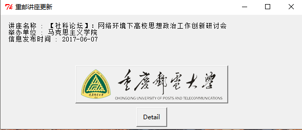

# 获取重庆邮电大学讲座信息更新并提醒

## 0x01 尝试
最开始的想法是将http://www.cqupt.edu.cn/cqupt/academic_news.shtml
用requests拿到之后，用beautifulsoup解析出详细信息，然而在拿到的html文件中没有找到讲座信息，想到网站应该是用ajax来加载数据的。


## 0x02 确定思路
在chrome的调试工具里，点击network中的XHR（XHR代表XMLHTTPrequest）找到如下接口：
http://www.cqupt.edu.cn/getPublicPage.do?ffmodel=notic&&nc_mode=news&page=1&rows=20
最简单的思路就是将接口请求结果(json格式)转成字典之后从中提取出讲座的title和id
```python
#-*- coding:utf-8 -*-
import requests
import json

url = "http://www.cqupt.edu.cn/getPublicPage.do?ffmodel=notic&&nc_mode=news&page=1&rows=20"
webdata = requests.get(url).text.encode('utf-8')
# with open('cqupt.json', 'wb') as f:
# 	f.write(webdata.encode('utf-8'))
decodejson = json.loads(webdata)
lecture_id = decodejson['rows'][0]['id'].encode('utf-8')
title 	   = decodejson['rows'][0]['nc_title'].encode('utf-8')
time       = decodejson['rows'][0]['puser_time'].encode('utf-8')
dept_name  = decodejson['rows'][0]['dept_name'].encode('utf-8')
print "讲座名称 : %s \n信息发布时间 : %s" %(title, time)
print "举办单位 : %s"%dept_name

```
根据id号 给出详情link
http://www.cqupt.edu.cn/getPublicNotic.do?id=8749


## 0x03 完善代码

 - 出错控制——try...except...
 - GUI窗口——easygui库
 - 开机自启动——编写bat脚本，放入windows启动文件夹内
windows10启动文件夹路径：
C:\Users\username\AppData\Roaming\Microsoft\Windows\Start Menu\Programs\Startup

```bat
@echo off
C:
cd C:\Users\98565\OneDrive\getlecture
start pythonw NewLectureNotify.py
exit
```
完整代码
```python
#-*- coding:utf-8 -*-

import json
import easygui
import requests
import webbrowser

def detail(lecture_id):
	#详情页url
	morelink = 'http://www.cqupt.edu.cn/getPublicNotic.do?id=%s'%lecture_id
	webbrowser.open(morelink)

if  __name__ == "__main__":
	try:
		user_agent = {'user-agent':'Mozilla/5.0'}
		url = "http://www.cqupt.edu.cn/getPublicPage.do?ffmodel=notic&&nc_mode=news&page=1&rows=20"
		response = requests.get(url, headers=user_agent, timeout=10)
		response.raise_for_status()
		webdata = response.text.encode('utf-8')
		#json转成字典
		decodejson = json.loads(webdata)
		lecture_id = decodejson['rows'][0]['id'].encode('utf-8')
		title 	   = decodejson['rows'][0]['nc_title'].encode('utf-8')
		time       = decodejson['rows'][0]['puser_time'].encode('utf-8')
		dept_name  = decodejson['rows'][0]['dept_name'].encode('utf-8')
		#文件保存最新的讲座id，只在有讲座信息更新时提醒
		with open("new_lecture_id.txt", "rb") as f:
			old_lecture_id = f.read()
		if int(lecture_id) > int(old_lecture_id):
			with open("new_lecture_id.txt", "wb") as f:
				f.write(lecture_id)

			button = easygui.buttonbox(msg = '讲座名称 : %s\n举办单位 : %s\n信息发布时间 : %s'%(title, dept_name, time),
			title = '重邮讲座更新', choices = ['Detail'], image = "logo.gif")
			if button == 'Detail':
				detail(lecture_id)
	except:
		easygui.msgbox("爬取讲座信息失败, 请检查网络是否正常连接")

```



点击detail按钮，启动浏览器打开讲座详情页面
代码见OldLectureNotify.py

## Update

不再使用easygui，而是使用windows的Toast通知。


通过左键点击trayicon进入讲座详情页面，双击trayicon退出。
实现上比较简单，调用win32api来检测trayicon是否被左键点击，双击等等，然后在
onClick函数中调用detail函数。

```python
    def onTaskbarNotify(self, hwnd, msg, wparam, lparam):
        if lparam == win32con.WM_LBUTTONUP:
            self.onClick()
        elif lparam == win32con.WM_LBUTTONDBLCLK:
            self.onDoubleClick()
        elif lparam == win32con.WM_RBUTTONUP:
            self.onRightClick()
        return 1

    def onClick(self):
        self.detail(self.lecture_id)

    def onDoubleClick(self):
        win32gui.PostQuitMessage(0)

    def detail(self, lecture_id):
        morelink = 'http://www.cqupt.edu.cn/getPublicNotic.do?id=%s' % lecture_id
        webbrowser.open(morelink)
```

</br>
主函数中可以设置icon_path的路径来改变显示的icon，默认参数就是使用windows系统的感叹号icon。
</br>

```python
if __name__ == "__main__":
    result = get_new_lecture()
    if result is not None:
        title, time, lecture_id, dept_name = result
        t = Taskbar(title=time.decode('utf-8'),
                    msg=title.decode('utf-8'),
                    lecture_id=lecture_id,
                    icon_path="../img/python.ico")
        t.showToast()
        win32gui.PumpMessages()
    else:
        pass
```

## Todo
1. 开机启动后，后台每隔一个小时检测一次有没有新的讲座更新
2. 用pyinstaller打包成exe
3. 利用Mac的pyobjc实现相同功能
